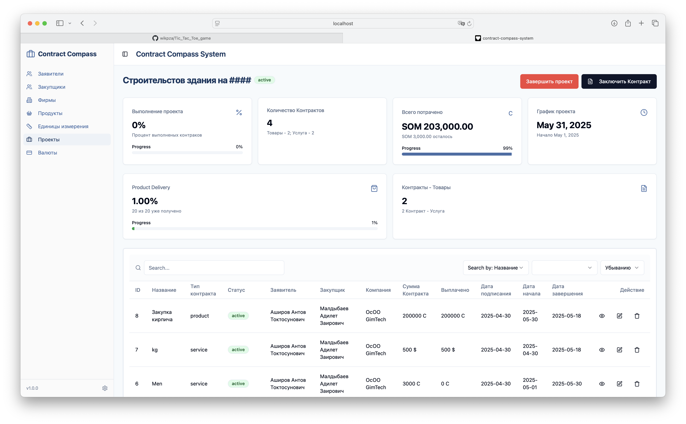

# Contract Compass


**Contract Compass** is a web application for managing contracts within various projects. It allows users to effectively handle applicants, suppliers, companies, products, currencies, documents, and all contract-related operations.



## 🧑‍💻 Tech Stack

### Backend:
- **Node.js** + **TypeScript**
- **Express.js**
- **Sequelize** — ORM for **Microsoft SQL Server**
- **MinIO** — object storage for managing documents

### Frontend:
- **React** + **TypeScript**
- **Tailwind CSS**
- **Shadcn UI** — modern UI component library

---

## 🚀 Features

### Core Entities:
- **Applicants** — create, update, delete
- **Suppliers** — create, update, delete
- **Companies** — create, update, delete
- **Products (Goods)** — create, update, delete
- **Measurement Units** — create, update, delete
- **Projects** — create, update, delete
- **Currencies** — manage available currencies

### Project Management:
- Each project has a **primary currency**
- Project statuses: **active** / **completed**


### Contracts (within projects):
- Two types: **Goods** and **Services**
- Each contract includes:
  - Signing date
  - Start and end dates
  - Amount
  - Currency (if different from the project’s primary one, an **exchange rate** is recorded)
- Features:
  - Attach documents of various types
  - Record payments (with full payment history)
  - Cancel, activate, or complete contracts
  - Ability to attach **external links** and **documents** to projects

### Additional for Goods-type Contracts:
- Track delivery: how much has arrived, how much was canceled
- A contract can be marked as completed once fully paid and all goods are received

---

## Classes (diagram)


## Classes (diagram)


## 📦 Project Structure

```bash
ContractCompass/
├── backend/              # Node.js server (Express + Sequelize)
├── frontend/             # React client (Tailwind + Shadcn UI)
├── README.md
└── ...
